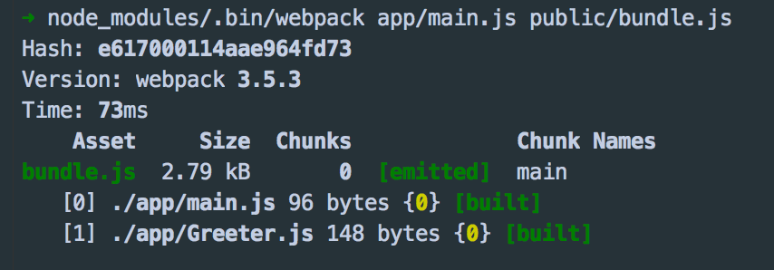
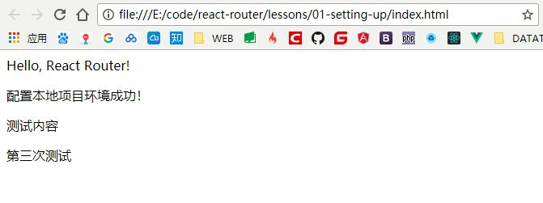
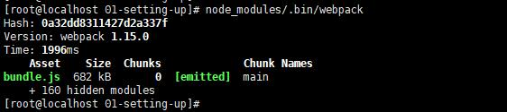

## Webpack学习笔记
> 作    者：Henery(henery_002@163.com)<br/>
> 时    间：2018/03/12<br/>
> 参考文章：

> 转载请注明出处。
<br/>

## 目录：
1. [认识Webpack](#1-认识webpack)
2. [使用Webpack](#2-使用webpack)
3. [Webpack的强大功能](#3-webpack的强大功能)
4. [babel](#4-babel)
5. [模块化思想](#5-模块化思想)
6. [插件](#6-插件)
7.


<br/><br/>

## 正文：
### 1. 认识Webpack
#### 1.1 为什么要使用Webpack
如今大多数网页都可以看做是功能丰富的应用，有着极其复杂的javascript代码和一大堆依赖包。为了简化开发的复杂度，前端社区涌现出了很多好的实践方法：
- **模块化**：让我们可以把复杂的程序细化为小的文件；
- 类似于Typescript这种在Javascript基础上拓展的开发语言：使我们能够实现目前版本的javascript不能直接使用的特性，并且之后还能转换为javascript文件使浏览器可以识别；
- Scss、Less等css预处理器
- ......
这些改进提高了开发效率，但是这样开发的文件往往需要进行额外的处理才能让浏览器识别，而手动处理又是很繁琐的事，这就为Webpack类工具的出现提供了需求。

#### 1.2 什么是Webpack
可以把Webpack看做是**模块打包机**：分析项目的结构，找到javascript模块以及其他的一些浏览器不能直接运行的拓展语言（Scss、Typescript等），并将其转换和打包为合适的格式供浏览器使用。

#### 1.3 Webpack和Grunt/gulp相比有什么特性
Gulp/Grunt是一种能够优化前端开发流程的工具，而Webpack是一种模块化的解决方案，不过Webpack的优点使得它在很多场景下可以替代Gulp/Grunt类的工具。<br/>
Grunt/Gulp的工作方式是：在一个配置文件中，指明对某些文件进行类似编译、组合、压缩等任务的具体步骤，之后工具可以自动完成这些任务。<br/>
Webpack的工作方式是：把项目当做一个整体，通过一个给定的主文件（如index.js），Webpack将从这个文件开始找到项目所有的依赖文件，使用loaders处理它们，最后打包为一个或多个浏览器可识别的javascript文件。<br/><br/>
如果实在要把二者进行比较，Webpack的处理速度更快更直接，能打包更多不同类型的文件。
<br/><br/>

### 2. 使用Webpack
在初步了解webpack的工作方式后，开始正式学习使用webpack。
#### 2.1 安装
webpack可以使用npm安装。我们可以新建一个空文件夹（此处我以在github上pull下来的react-router的练习项目作为目标文件夹），使用命令行到该目录下执行以下命令即可完成安装。
```
//全局安装
npm install -g webpack
//安装到项目目录
npm install --save-dev webpack
```

#### 2.2 准备工作
1. 在上述文件夹中创建一个package.json文件，这是一个标准的npm说明文件，内容包括当前项目的依赖模块、自定义的脚本任务等。也可以使用 npm init 命令自动创建 package.json 文件。
```
npm init
```
执行完该命令后，系统会提示填写一系列诸如项目名称、项目描述、作者等信息，这些内容可以默认不填写，回车。

2. package.json文件生成后，开始在本项目中安装webpack作为依赖包：
```
//安装webpack
npm install --save-dev webpack
```
3. 在项目根目录下创建两个文件夹：app / public，app文件夹用来存放原始数据和js模块，public文件夹用来存放之后供浏览器读取的文件，包括使用webpack生成的js文件以及index.html文件。然后再创建三个文件：
- index.html    放在public文件夹中
- Greeter.js    放在ap文件夹中
- main.js       放在app文件夹中
此时项目结构如下所示：
```
react-router
  |___node_modules
  |___app
  |   |___Greeter.js
  |   |___main.js
  |___public
  |   |___index.html
  |___package.json
```
我们可以在index.html中写入基础的html代码，目的在于引入打包后的js文件（bundle.js，后面将详述）。
```html
<!-- index.html -->
<!DOCTYPE html>
<html lang="en">
  <head>
    <meta charset="utf-8">
    <title>Webpack Sample Project</title>
  </head>
  <body>
    <div id='root'>
    </div>
    <script src="bundle.js"></script>
  </body>
</html>
```
然后在Greeter.js中定义一个返回包含问候信息的html元素的函数，并依据CommonJS规范到处这个函数作为一个模块：
```javascript
// Greeter.js
module.exports = function() {
    var greet = document.createElement('div');
    greet.textContent = "The First React App";
    return greet;
};
```
main.js中写入下述代码，用以把Greeter模块返回的节点插入到页面。
```
// main.js
const greeter = require('./Greeter.js');
document.querySelector('#root').appendChild(greeter());
```

#### 2.3 开始使用Webpack打包
在命令行中webpack的使用方式如下：
```
# { extry file }    填写入口文件的路径，本文中就是上述main.js的路径，
# { destination for bundled file }    填写打包文件的存放路径
# 填写路径的时候不用添加{ }，如：
webpack { entry file } { destination for bundled file }
```
在指定了入口文件后，webpack将自动识别项目所依赖的其他文件，不过需要注意的是**如果webpack不是全局安装的话，在使用该命令时需要指定其在 node_modules 中的地址**，如：
```
# webpack非全局安装的情况
node_modules/.bin/webpack app/main,js public/bundle.js
```
执行结果如下：<br/>
<br/>
可以看到webpack同时编译了main.js和Greeter.js。现在在浏览器中打开index.html文件，可以看到正常的页面：<br/>
<br/>
至此，已经成功使用webpack进行文件打包。**但是在命令行中执行如此复杂的操作并不方便，且容易出错**。

下面来看webpack的另一种更常用的打包方法。

#### 2.4 通过配置文件使用Webpack
webpack拥有很多其他高级功能，如后文将要讲述的loaders和plugins，这些功能都可以通过命令行模式实现，但是这样不方便并且易出错。更好的办法是定义一个配置文件（该配置文件也是一个javascript模块），将所有与打包相关的信息放在里面。

在当前根目录下新建一个webpack.config.js文件，写入简单的配置代码：
```
module.exports = {
    entry: __dirname + "/app/main.js",    //唯一入口文件
    output: {
        path: __dirnmae + "/public",      //打包后文件的存放位置
        filename: "bundle.js"             //打包后输出文件的文件名
    }
}
```
> 注："__dirname"是node.js中的一个全局变量，它指向当前执行脚本所在的目录。

webpack.config.js文件配置好后，再进行打包操作时，只需要执行
```
webpack (非全局安装时需要执行 node_modules/.bin/webpack)
```
即可，该目录会自动引用webpack.config.js文件中的配置选项。<br/>
<br/>
这样一来，不用再使用繁琐的打包参数就能够打包。

事实上，还有一种更便捷的执行打包方式，连 webpack(非全局安装时使用node_modules/.bin/webpack)命令都不需要使用。

#### 2.5 更快捷的打包方式
在命令行中输入上述 node_modules/.bin/webpack 命令较为繁琐，不过好在npm可以引导任务的执行，对npm进行配置后可以在命令行中使用简单的 npm start 命令来代替上面略微繁琐的命令。

在 package.json 中对scripts对象进行相关设置即可，方法如下：
```javascript
{
    "name": "webpack-sample-project",
    "version": "1.0.0",
    "description": "Sample webpack project",
    "scripts": {
        "start": "webpack"    //修改此处。json文件不支持注释，所以在引用时务必清除
    },
    "author": "...",
    "lisence": "ISC",
    "devDependencies": {
        "webpack": "3.10.0"
    }
}
```
> 注：package.json中的scripts会按照一定的顺序寻找命令对应的位置，本地的 node_modules/.bin 路径就在这个寻找的清单中，所以无论是全局安装还是局部安装的webpack，都不再需要在webpack前面指明详细的路径。


<br/><br/>

### 3. Webpack的强大功能
#### 3.1