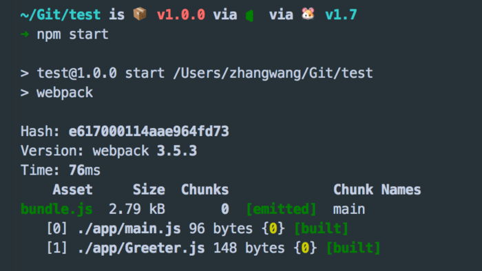
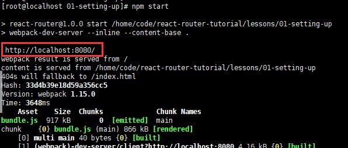
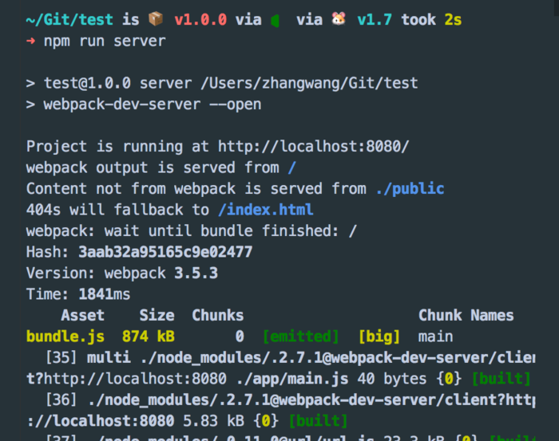
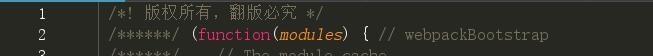
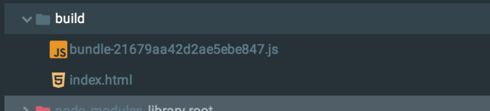

## Webpack学习笔记
> Author    ：Henery(henery_002@163.com)<br/>
> Time      ：2018/03/12<br/>
> Reference ：

> 转载请注明出处。
<br/>

## 目录：
1. [认识Webpack](#1-认识webpack)
2. [使用Webpack](#2-使用webpack)
3. [Webpack的强大功能](#3-webpack的强大功能)
4. [Babel](#4-babel)
5. [模块](#5-模块)
6. [插件](#6-插件)
7. [产品阶段的构建](#7-产品阶段的构建)


<br/>

## 正文：
### 1. 认识Webpack
#### 1.1 为什么要使用Webpack
如今大多数网页都可以看做是功能丰富的应用，有着极其复杂的javascript代码和一大堆依赖包。为了简化开发的复杂度，前端社区涌现出了很多好的实践方法：
- **模块化**：让我们可以把复杂的程序细化为小的文件；
- 类似于Typescript这种在Javascript基础上拓展的开发语言：使我们能够实现目前版本的javascript不能直接使用的特性，并且之后还能转换为javascript文件使浏览器可以识别；
- Scss、Less等css预处理器
- ......

这些改进提高了开发效率，但是这样开发的文件往往需要进行额外的处理才能让浏览器识别，而手动处理又是很繁琐的事，这就为Webpack类工具的出现提供了需求。

#### 1.2 什么是Webpack
可以把Webpack看做是**模块打包机**：分析项目的结构，找到javascript模块以及其他的一些浏览器不能直接运行的拓展语言（Scss、Typescript等），并将其转换和打包为合适的格式供浏览器使用。

#### 1.3 Webpack和Grunt/gulp相比有什么特性
Gulp/Grunt是一种能够优化前端开发流程的工具，而Webpack是一种模块化的解决方案，不过Webpack的优点使得它在很多场景下可以替代Gulp/Grunt类的工具。<br/>
Grunt/Gulp的工作方式是：在一个配置文件中，指明对某些文件进行类似编译、组合、压缩等任务的具体步骤，之后工具可以自动完成这些任务。<br/>
Webpack的工作方式是：把项目当做一个整体，通过一个给定的主文件（如index.js），Webpack将从这个文件开始找到项目所有的依赖文件，使用loaders处理它们，最后打包为一个或多个浏览器可识别的javascript文件。<br/>
如果实在要把二者进行比较，Webpack的处理速度更快更直接，能打包更多不同类型的文件。
<br/>

### 2. 使用Webpack
在初步了解webpack的工作方式后，开始正式学习使用webpack。
#### 2.1 安装
webpack可以使用npm安装。我们可以新建一个空文件夹（此处我以在github上pull下来的react-router的练习项目作为目标文件夹），使用命令行到该目录下执行以下命令即可完成安装。
```
//全局安装
npm install -g webpack
//安装到项目目录
npm install --save-dev webpack
```

#### 2.2 准备工作
1. 在上述文件夹中创建一个package.json文件，这是一个标准的npm说明文件，内容包括当前项目的依赖模块、自定义的脚本任务等。也可以使用 npm init 命令自动创建 package.json 文件。
```javascript
npm init
```
执行完该命令后，系统会提示填写一系列诸如项目名称、项目描述、作者等信息，这些内容可以默认不填写，回车。

2. package.json文件生成后，开始在本项目中安装webpack作为依赖包：
```javascript
//安装webpack
npm install --save-dev webpack
```
3. 在项目根目录下创建两个文件夹：app / public，app文件夹用来存放原始数据和js模块，public文件夹用来存放之后供浏览器读取的文件，包括使用webpack生成的js文件以及index.html文件。然后再创建三个文件：
- index.html    放在public文件夹中
- Greeter.js    放在ap文件夹中
- main.js       放在app文件夹中
此时项目结构如下所示：
```javascript
react-router
  |___node_modules
  |___app
  |   |___Greeter.js
  |   |___main.js
  |___public
  |   |___index.html
  |___package.json
```
我们可以在index.html中写入基础的html代码，目的在于引入打包后的js文件（bundle.js，后面将详述）。
```html
<!-- index.html -->
<!DOCTYPE html>
<html lang="en">
  <head>
    <meta charset="utf-8">
    <title>Webpack Sample Project</title>
  </head>
  <body>
    <div id='root'>
    </div>
    <script src="bundle.js"></script>
  </body>
</html>
```
然后在Greeter.js中定义一个返回包含问候信息的html元素的函数，并依据CommonJS规范到处这个函数作为一个模块：
```javascript
// Greeter.js
module.exports = function() {
    var greet = document.createElement('div');
    greet.textContent = "The First React App";
    return greet;
};
```
main.js中写入下述代码，用以把Greeter模块返回的节点插入到页面。
```javascript
// main.js
const greeter = require('./Greeter.js');
document.querySelector('#root').appendChild(greeter());
```

#### 2.3 开始使用Webpack打包
在命令行中webpack的使用方式如下：
```javascript
# { extry file }    填写入口文件的路径，本文中就是上述main.js的路径，
# { destination for bundled file }    填写打包文件的存放路径
# 填写路径的时候不用添加{ }，如：
webpack { entry file } { destination for bundled file }
```
在指定了入口文件后，webpack将自动识别项目所依赖的其他文件，不过需要注意的是**如果webpack不是全局安装的话，在使用该命令时需要指定其在 node_modules 中的地址**，如：
```javascript
# webpack非全局安装的情况
node_modules/.bin/webpack app/main,js public/bundle.js
```
执行结果如下：<br/>
<br/>
可以看到webpack同时编译了main.js和Greeter.js。现在在浏览器中打开index.html文件，可以看到正常的页面：<br/>
<br/>
至此，已经成功使用webpack进行文件打包。**但是在命令行中执行如此复杂的操作并不方便，且容易出错**。

下面来看webpack的另一种更常用的打包方法。

#### 2.4 通过配置文件使用Webpack
webpack拥有很多其他高级功能，如后文将要讲述的loaders和plugins，这些功能都可以通过命令行模式实现，但是这样不方便并且易出错。更好的办法是定义一个配置文件（该配置文件也是一个javascript模块），将所有与打包相关的信息放在里面。

在当前根目录下新建一个webpack.config.js文件，写入简单的配置代码：
```javascript
module.exports = {
    entry: __dirname + "/app/main.js",    //唯一入口文件
    output: {
        path: __dirnmae + "/public",      //打包后文件的存放位置
        filename: "bundle.js"             //打包后输出文件的文件名
    }
}
```
> 注："__dirname"是node.js中的一个全局变量，它指向当前执行脚本所在的目录。

webpack.config.js文件配置好后，再进行打包操作时，只需要执行
```javascript
webpack (非全局安装时需要执行 node_modules/.bin/webpack)
```
即可，该目录会自动引用webpack.config.js文件中的配置选项。<br/>
<br/>
这样一来，不用再使用繁琐的打包参数就能够打包。

事实上，还有一种更便捷的执行打包方式，连 webpack(非全局安装时使用node_modules/.bin/webpack)命令都不需要使用。

#### 2.5 更快捷的打包方式
在命令行中输入上述 node_modules/.bin/webpack 命令较为繁琐，不过好在npm可以引导任务的执行，对npm进行配置后可以在命令行中使用简单的 npm start 命令来代替上面略微繁琐的命令。

在 package.json 中对scripts对象进行相关设置即可，方法如下：
```javascript
{
    "name": "webpack-sample-project",
    "version": "1.0.0",
    "description": "Sample webpack project",
    "scripts": {
        "start": "webpack"    //修改此处。json文件不支持注释，所以在引用时务必清除
    },
    "author": "...",
    "lisence": "ISC",
    "devDependencies": {
        "webpack": "3.10.0"
    }
}
```
> 注：package.json中的scripts会按照一定的顺序寻找命令对应的位置，本地的 node_modules/.bin 路径就在这个寻找的清单中，所以无论是全局安装还是局部安装的webpack，都不再需要在webpack前面指明详细的路径。

npm的start命令是一个特殊的脚本命令，其特殊性表现在：在命令行中使用 npm start 就可以执行器对应的命令，如果对应的此脚本名称不是start，想要在命令行中运行时，需要使用 npm run { script name } 如 npm run build。当在命令行中输入 npm start 时，输出结果如下：<br/>
<br/>
<br/>
（图二为自己实战测试截图，但发现无法使用本地8080端口访问，原因暂不详）

现在只需要使用 npm start 就可以打包文件了。

如果想充分发挥webpack的强大功能，还可以修改配置文件的其他选项。下文详述。

<br/>

### 3. Webpack的强大功能
#### 3.1 生成Source Maps（便于调试）
开发总是离不开调试，方便的调试能极大的提高开发效率，不过有时通过打包后的文件不易找到出错的地方对应的代码的位置，Source Maps就是来帮我们解决这个问题的。

通过简单的配置，webpack就可以在打包时生成source maps，提供了一种对应编译文件和源文件的方法，使得编译后的代码可读性更高，也更容易调试。

在webpack的配置文件中配置source maps，需要配置devtool。它有一下四种不同的配置选项，优缺点如下：

| devtool | 配置结果 |
| - | - |
| source-map | 在一个单独的文件中产生一个完整且功能完全的文件。该文件具有最好的source map，但他会减慢打包速度 |
| cheap-module-source-map | 在一个单独的文件中生成一个不带列映射的map，不带列映射提高了打包速度，但也使得浏览器开发者工具只能对应到具体的行，不能对应到具体的列（符号），会对调试造成不便 |
| eval-source-map | 使用eval打包源文件模块，在同一个文件中生成干净完整的source map。该选项可以在不影响构建速度的前提下生成完整的source-map，但对打包后输出的js文件的执行具有性能和安全的隐患。适合于开发阶段，不适合于生产阶段 |
| cheap-module-eval-source-map | 在打包文件时生成source map最快的方法。生成的source map会和打包后的js文件同行显示，没有列映射，和eval-source-map选项具有相似的缺点 |

上述选项由上到下打包速度越来越快，不过同时也具有越多的负面作用，较快的打包速度的后果就是对打包后文件的执行有一定影响。

对中小型项目来说eval-source-map是一个不错的选择，只应该在开发阶段使用。

我们继续对上文中新建的webpack.config.js进行如下配置：
```javascript
module.exports = {
    devtool: 'eval-source-map',
    entry: __dirname + '/app/main.js',
    output: {
        path: __dirname + '/public',
        filename: 'bundle.js'
    }
}
```
> 注：cheap-module-eval-source-map方法构建速度更快，但不利于调试。推荐在大型项目考虑时间成本时使用。

#### 3.2 使用Webpack构建本地服务器
如果想让浏览器同步同步监听代码的修改，并自动刷新显示修改后的结果，那么可以借助webpack搭建本地开发服务器。这个服务器基于node.js构建，可以实现想要的功能。不过他是一个单独的组件，在webpack中进行配置之前要将其作为项目以来单独安装
```javascript
npm install --save-dev webpack-dev-server
```
以下是devserver作为webpack配置项的一些配置参数，更多配置参数请参见[官网](https://webpack.js.org/configuration/dev-server/)。

| devserver的配置选项 | 功能描述 |
| contentBase | 默认webpack-dev-server会为根文件夹提供本地服务器。如果想为另一个目录下的文件提供本地服务器，应该在这里设置其所在目录（本例中设置到"public"目录） |
| port | 设置默认监听端口。如果省略，默认为8080 |
| inline | 设置为true，当源文件改变时会自动刷新 |
| historyApiFallback | 在开发单页应用时非常有用。它依赖于HTML5 history API，如果设置为true，所有的跳转将指向index.html|

把这些命令加到webpack的配置文件中，现在的配置文件webpack.config.js如下所示：
```javascript
module.exports = {
    devtool: 'eval-source-map',
    entry: __dirname + '/app/main.js',
    output: {
        path: __dirname + 'public',
        filename: 'bundle.js'
    },

    devServer: {
        contentBase: './public',    //本地服务器所加载的页面所在的目录
        historyApiFallback: true,   //不跳转
        inline: true                //实时刷新
    }
}
```
然后再在package.json中的scripts对象中添加如下命令，用以开启本地服务器：
```javascript
"scripts": {
    "test": "echo \'Error: no test specified\' && exit 1",
    "start": "webpack",
    "server": "webpack-dev-server --open"
},
```
现在，在命令行中输入 npm run server ，即可在本地8080端口查看结果。<br/>
<br/>

#### 3.3 Loaders
Loaders是webpack提供的非常重要的功能。通过使用不同的loader，webpack有能力调用外部的脚本或工具，实现对不同格式文本的处理。如分析转换scss为css、把es6文件转换为现代浏览器可识别的js文件，对React开发而言，合适的loaders可以把React中用到的JSX文件转换为js文件。

Loaders需要单独安装且需要在webpack.config.js中的modules关键字中进行配置。其配置包括以下方面：
- test：一个用以匹配loaders所处理的文件的拓展名的正则表达式（必须）
- loader：loader的名称（必须）
- include/exclude：手动添加必须处理的文件/文件夹或屏蔽不需要处理的文件/文件夹（可选）
- query：为loaders提供额外的设置选项（可选）

不过在配置loader之前，我们可以把Greeter.js中的内容放在一个单独的json文件中，并通过合适的配置使Greeter.js可以读取json文件的值。

各文件修改后的代码如下（在根文件夹中创建带有文本内容的json文件，命名为config.json）：
```javascript
{
    "greetTxt": "This is my first webpack app"
}
```
更新后的Greeter.js：
```javascript
var config = require('./config.json');

module.exports = function() {
    var greet = document.createElement('div');
    greet.textContent = config.greetText;
    return greet;
};
```
> 注：由于 webpack3.*  / webpack2.* 已经内置可处理json文件，这里就不需要再添加 webpack1.* 需要的json-loader了。在看如何具体使用loader之前不妨先来看看Babel是什么。

<br/>

### 4. Babel
Babel是一个编译javascript代码的平台，它可以帮助开发者：

- 使用最新的javascript代码，如es6、es7，而不需要担心新标准是否被当前浏览器完全支持
- 使用基于javascript进行了拓展的语言，如JSX

#### 4.1 Babel的安装与配置
Babel其实是几个模块化的包，其核心功能位于成为babel-core的npm包中。webpack可以把不同的包整合在一起使用，对于每一个需要的功能或拓展，都需要安装单独的包（常用的是用于解析ES6的 babel-env-preset 包和用于解析JSX的 babel-preset-react 包）。

首先一次性安装这些包：
```javascript
// npm一次性安装多个依赖模块时，模块之间使用空格隔开
npm install --save-dev babel-core babel-loader babel-preset-env babel-preset-react
```
在webpack中配置Babel的方法如下：
```javascript
module.exports = {
    entry: __dirname + "/app/main.js",      //入口文件
    output: {
        path: __dirname + "/public",        //打包文件存放位置
        filename: "bundle.js"               //打包文件的文件名
    },
    devtool: 'eval-source-map',
    devServer: {
        contentBase: "./public",            //本地服务器所加载的页面所在目录
        historyApiFallback: true,           //不跳转
        inline: true                        //实时刷新
    },
    module: {
        rules: [
            {
                test: /(\.jsx|\.js)$/,
                use: {
                    loader: "babel-loader",
                    options: {              //babel配置项
                        presets: [
                            "env", "react"
                        ]
                    }
                },
                exclude: /node_modules/
            }
        ]
    }
};
```
如此一来，webpack的配置已经允许使用ES6及JSX语法了，可以继续上文的例子进行测试。

现在我们引入React，使用React做练习测试。

首先安装React和React-DOM：
```javascript
npm install --save-dev react react-dom
```
下面我们使用ES6语法修改Greeter.js并返回一个React组件：
```javascript
// Greeter.js
import React, {Component} from 'react';
import config from './config.json';

class Greeter extends Component{
    render(){
        return (
            <div>
                {config.greetText}
            </div>
        );
    }
}

export default Greeter;
```
然后修改main.js如下，使用ES6的模块定义和渲染Greeter模块：
```javascript
// main.js
import React from 'react';
import {render} from 'react-dom';
import {Greeter} from './Greeter.js';

render(
    <Greeter />,
    document.getElementById('root');
);
```
最后，重新使用nm start命令打包，打开本地服务器上的页面，会发现和使用babel之前的页面内容是一样的。这说明react和es6已经被正常打包了。

#### 4.2 Babel的配置
如上所述，Babel可以在webpack.config.js中作配置。但是考虑到babel配置选项的复杂性，一些开发者偏向于把babel配置项单独放在一个名为 .babelrc 的配置文件中。虽然在本项目中目前的babel配置并不复杂，但后续会添加一些内容，因此现在我们将提取出babel的配置项单独配置。

> 注：webpack会自动调用 .babelrc 里的babel配置项。

```javascript
module.exports = {
    entry: __dirname + "/app/main.js",          //入口文件
    output: {
        path: __dirname + "/public",            //打包后文件存放位置
        filename: "bundle.js"                   //打包文件的文件名
    },
    devtool: 'eval-source-map',
    devServer: {
        contentBase: "./public",                //本地服务器所加载的页面所在目录
        historyApiFallback: true,               //不跳转
        inline: true                            //实时刷新
    },
    module: {
        rules: [
            {
                test: /(\.jsx|\.js)$/,
                use: {
                    loader: "babel-loader"
                },
                exclude: /node_modules/
            }
        ]
    }
};
```
```
// .babelrc
{
    "preset": ["react", "env"]
}
```
现在看来，对于模块来说，webpack能够提供非常强大的功能，那么哪些是模块呢？

<br/>

### 5. 模块
Webpack有一个优点，它把所有文件都当做模块处理，js代码、css、fonts以及图片等等资源通过合适的loader都可以被处理。

#### 5.1 css
webpack提供两个工具处理样式表 css-loader 和 style-loader ，二者处理的任务不同。

- css-loader 能够使我们用类似 @import 和 url(...) 的方法实现 require() 的功能
- style-loader 将所有计算后的样式加入页面中

二者组合使用能够把样式表嵌入到webpack打包后的js文件中。

继续上例，安装使用这两个工具：
```javascript
// 安装
npm install --save-dev style-loader css-loader
```
```javascript
// 使用
module.exports = {
    ...
    module: {
        rules: [
            {
                test: /{\.jsx|\.js}$/,
                use: { loader: "babel-loader" },
                exclude: /node_modules/
            },
            {
                test: /\.css$/,
                use: [
                    { loader: "style-loader" },         //这里对同一个文件引入多个loader
                    { loader: "css-loader" }
                ]
            }
        ]
    },
    ...
};
```
> 注：请注意这里对同一个文件引入多个loader的方法。

接下来在app文件夹下创建一个名为 main.css 的文件，对页面做一些样式设置：
```css
/* main.css */
html {
  box-sizing: border-box;
  -ms-text-size-adjust: 100%;
  -webkit-text-size-adjust: 100%;
}

*, *:before, *:after {
  box-sizing: inherit;
}

body {
  margin: 0;
  font-family: 'Helvetica Neue', Helvetica, Arial, sans-serif;
}

h1, h2, h3, h4, h5, h6, p, ul {
  margin: 0;
  padding: 0;
}
```
在该例中用到的webpack只有单一入口，其他的模块需要通过import、require、url等与入口文件建立关联。

为了能让webpack找到 main.css 文件，将其导入到 main.js 中：
```javascript
// main.js
import React from 'react';
import {render} from 'react-dom';
import Greeter from './Greeter';

import './main.css';                //使用require导入main.css文件

render(
    <Greeter />,
    document.getElementById('root')
);

```
> 注：通常情况下，css和js会被打包到同一个文件中，并不会打包为一个单独的css文件。不过通过合适的配置，webpack同样也可以把css打包为单独的文件。

上述案例说明了webpack是如何把css当做模块看待的。下面继续来看一个更加真实的css模块实践。

#### 5.2 CSS module
近几年，javascript借助于一些新的语言特性、更好的工具以及更好的实践方法（如模块化）发展迅速，模块化使得开发者将复杂的代码转化为小的、干净的、依赖声明明确的单元，配合优化工具，依赖管理和加载管理可以自动完成。

相较而言，css的发展则显得慢一些，大多样式表却依旧巨大而且充满了全局类名，维护和修改都非常困难。

css module技术意在将js的模块化思想带入css中来。通过css模块，所有的类名、动画名都默认只作用于当前模块。webpack对css模块化提供了非常好的支持，只需要在css loader中进行简单配置即可，然后就可以直接把css类名引入到组件代码中。这样做有效避免了全局污染。

代码如下：

```javascript
module.exports = {
    ...
    module: {
        rules: [
            {
                test: /{\.jsx|\.js}$/,
                use: { loader: "babel-loader" },
                exclude: "node_modules"
             },
            {
                test: /\.css$/,
                use: [
                    {
                        loader: "style-loader"
                    },
                    {
                        loader: "css-loader",
                        options: {
                            modules: true,              // 指定启用 css modules
                            localIndentName: '[name]__[local]--[hash:base64:5]'         //指定css的类名格式
                        }
                    }
                ]
            }
        ]
    },
    ...
};
```
现在我们在app文件夹下创建一个 Greeter.css 文件进行测试：
```css
/* Greeter.css */
.root{
    background-color: #eee;
    padding: 10px;
    border: 3px solid #ccc;
}
```
然后将类名 .root 导入到 Greeter.js 中：
```javascript
import React,{Component} from 'react';
import config from './config.json';
import styles from './Greeter.css';             //导入css文件

class Greeter extends Component{
    render(){
        return (
            <div className={styles.root}>       //使用css module添加类名的方法
                {config.greetText}
            </div>
        );
    }
}

export default Greeter;

```
现在就可以放心使用css module添加类名的方法了，即使是相同的类名也不会造成不同组件之间的污染。

更多关于css module的信息，请参见[官方文档](https://github.com/css-modules/css-modules)。

#### 5.3 CSS预处理器
像Sass、Less之类的预处理器是对原生css的拓展，它们允许开发者使用类似于variables、nesting、mixins、inheritance等css中没有的特性来写css，css预处理器可以将这些特殊类型的语句转化为浏览器可识别的常规css语句。

> 注：关于[Sass/Less](https://github.com/Henery002/MDFileSet/blob/master/Less%E5%AD%A6%E4%B9%A0%E7%AC%94%E8%AE%B0.md)详细内容，可参见我在github上的其他文章。

经过上述针对webpack的剖析，我们知道只需要使用相关loader并进行对应的配置就可以使用css预处理器了。

以下是常用的css处理loaders:
- Less Loader
- Sass Loader
- Stylus Loader

还有一个用于处理css的平台PostCSS可以实现css的更多功能，详见[官方文档](https://github.com/postcss/postcss)。

举例说明如何使用PostCSS。如使用PostCSS为css代码自动添加适应不同浏览器的css前缀。

首先需要安装postcss-loader和autoorefixer（自动添加前缀的插件）：
```javascript
npm install --save-dev postcss-loader autoprefixer
```
然后在webpack配置文件中添加postcss-loader，在根目录新建postcss.config.js并添加如下代码之后，重新使用 npm start 打包，如此一来，css代码就会自动添加不同前缀。
```javascript
// webpack.config.js
module.exports = {
    ...
    module: {
        rules: [
            {
                test: /(\.jsx|\.js)$/,
                use: { loader: "babel-loader" },
                exclude: /node_modules/
            },
            {
                test: /\.css$/,
                use: [
                    { loader: "style-loader" },
                    {
                        loader: "css-loader",
                        options: { modules: true }
                    },
                    { loader: "postcss-loader" }            //新加loader
                ]
            }
        ]
    },
    ...
}
```
```javascript
// postcss.config.js
module.exports = {
    plugins: [ require('autoprefixer') ]
}
```
到了这里，本文已经谈论了处理js的Babel和处理css的PostCSS的基本用法，它们也是两个单独的平台了，配合webpack使用可以很好的发挥其作用。

<br/>

### 6. 插件（Plugins）
插件用以拓展webpack功能，在整个架构过程中生效，执行相关任务。

Loaders和Plugins是不同的工具，易被混淆。loaders是在打包构建过程中用来处理源文件（JSX、Scss、Less）的，而插件不直接操作单个文件，它直接对整个构建过程起作用。

webpack有很多内置插件，也有一些第三方插件，辅以完成更多功能。

#### 6.1 使用插件的方法
插件在使用前，需要通过npm安装，然后在webpack.config.js配置文件中的plugins关键字部分添加该插件的一个实例（plugins是一个数组）。

如使用为打包后的代码添加版权声明的插件：
```javascript
const webpack = require('webpack');

module.exports = {
    ...
    module: {
        rules: [
            {
                test: /{\.jsx|\.js}$/,
                use: { loader: "babel-loader" },
                exclude: /node_modules/
            },
            {
                test: /\.css$/,
                use:[
                    { loader: 'style-loader' },
                    {
                        loader: 'css-loader',
                        options: {
                            modules:true
                        }
                    },
                    { loader: 'postcss-loader' }
                ]
            }
        ]
    },
    plugins: [
        new webpack.BannerPlugin('版权所有，翻版必究！')
    ]
};
```
打包后的bundle.js文件头部显示为：<br/>
<br/>
这就是webpack插件的基本用法。

下面将推荐几款常用的插件。

#### 6.2 HtmlWebpackPlugin
* 作用

根据一个简单的index.html模板生成一个自动引用打包后js文件的新index.html。该插件在每次都生成不同名称的js文件时非常有用（如添加了hash值）。

* 安装：
```javascript
npm install --save-dev html-webpack-plugin
```
该插件自动完成了之前需要手动完成的事项。在正式使用之前，需要对一直以来的项目结构做一些调整：
1. 移除public文件夹。index.html会由该插件自动生成，css文件也已通过之前的操作打包到了js中。
2. 在app目录下创建index.tmpl.html文件模板。该模板即为常规的html文件框架。在编译过程中插件会依据此模板生成最终的html页面，自动添加所依赖的css/js/fonts等文件。
index.tmpl.html模板：
```html
<!DOCTYPE html>
<html lang='en'>
    <head>
        <meta charset='utf-8'>
        <title>Webpack Sample Project</title>
    </head>
    <body>
        <div id='root'>
        </div>
    </body>
</html>
```
3. 添加webpack配置文件，方法同上。新建一个build文件夹用以存放最终的输出文件。
```javascript
const webpack = require('webpack');
const HtmlWebpackPlugin = require('html-webpack-plugin');

module.exports = {
    entry: ...
    output: ...
    devtool: ...
    devServer: ...
    module: ...             //同5.3小节配置参数
    plugins: [
        new webpack.BannnerPlugin('版权所有，翻版必究'),
        new HtmlWebpackPlugin({
            template: __dirname + '/app/index.tmpl.html'        //new一个该插件的实例并传入相关参数
        })
    ]
};
```
再次执行npm start打包，会发现build文件下生成了bundle.js和index.html：
```javascript
test
  |___app
  |___build
  |   |___bundle.js
  |   |____index.html
  |___node_modules
  |___package.json
```

#### 6.3 Hot Module Replacement
Hot Module Replacement(HMR)插件可以让组件代码修改后自动刷新实时预览修改后的效果。

在webpack中使用HMR需要做两项配置：
- 在webpack配置文件中添加HMR插件
- 在Webpack Dev Server中添加 hot 参数

但是在配置完这些后js模块还是不能自动热加载，还需要在js模块中执行一个webpack提供的API才能实现热加载。虽然这个API不难使用，但如果是React模块，那么使用我们之前已经熟悉的Babel可以更方便的实现热加载功能。

具体实现方法为：
- Babel和webpack是独立的工具
- 二者可以一起工作
- 二者都可以通过插件来拓展功能
- HMR是一个webpack插件，可以在浏览器端自动实时刷新修改后的效果。需要对模块进行额外的配置才能使其生效。
- Babel中的react-transform-hrm插件可以在不对React模块进行额外配置的前提下让HMR生效

具体配置：
```javascript
const webpack = require('webpack');
const HtmlWebpackPlugin  = require('html-webpack-plugin');

module.exports = {
    entry: __dirname + "/app/main.js",          //入口文件
    output: {
        path: __dirname + "/build",
        filename: "bundle.js"
    },
    devtool: 'eval-source-map',
    devServer: {
        contentBase: "./public",                //本地服务器加载的页面所在目录
        historyApiFallback: true,               //不跳转
        inline: true,
        hot: true                               //热加载
    },
    module: {
        rules: [
            {
                test: /(\.jsx|\.js)$/,
                use: { loader: "babel-loader" },
                exclude: /node_modules/
            },
            {
                test: /\.css$/,
                use: [
                    { loader: "style-loader" },
                    {
                        loader: "css-loader",
                        options: { modules: true }
                    },
                    { loader: "postcss-loader" }
                ]
            }
        ]
    },
    plugins: [
        new webpack.BannerPlugin('版权所有，翻版必究'),
        new HtmlWebpackPlugin({ template: __dirname + '/app/index.tmpl.html' }),        //new一个插件的实例并传入相关参数
        new webpack.HotModuleReplacementPlugin()            //热加载插件
    ]
};
```
安装react-transform-hmr
```javascript
npm install --save-dev babel-plugin-react-transform react-transform-hmr
```
配置Babel
```javascript
// .babelrc
{
    "presets": ["react", "env"],
    "env": {
        "develoment": {
            "plugins": [
                [
                    "react-transform",
                    {
                        "transforms": [
                            {
                                "transform": "react-transform-hmr",
                                "imports": ["react"],
                                "locals": ["module"]
                            }
                        ]
                    }
                ]
            ]
        }
    }
}
```
如此一来，就可以在使用React的时候实现热加载了。

<br/>

### 7. 产品阶段的构建
到目前为止，已经使用webpack构建了一个完整的开发环境。但是在产品阶段，可能还需要对打包的文件进行额外的处理，如优化、压缩、缓存、分离css和js等等......

对于复杂的项目来说，需要将复杂的配置文件分解成多个小文件。以上述案例为例，我们创建一个webpack.production.config.js文件，配置其基本项，类似于上述案例的原始webpack.config.js文件。

> 注：注意与上述配置参数作对比。

```javascript
const webpack = require('webpack');
const HtmlWebpackPlugin  = require('html-webpack-plugin');

module.exports = {
    entry: __dirname + "/app/main.js",          //入口文件
    output: {
        path: __dirname + "/build",
        filename: "bundle.js"
    },
    devtool: null,              //注意此处做了修改，可以大大压缩打包的代码
    devServer: {
        contentBase: "./public",                //本地服务器加载的页面所在目录
        historyApiFallback: true,               //不跳转
        inline: true,
        hot: true                               //热加载
    },
    module: {
        rules: [
            {
                test: /(\.jsx|\.js)$/,
                use: { loader: "babel-loader" },
                exclude: /node_modules/
            },
            {
                test: /\.css$/,
                use: ExtractTextPlugin.extract({                //有修改
                    fallback: "style-loader",
                    use: [
                        {
                            loader: "css-loader",
                            options: { modules: true }
                        },
                        { loader: "postcss-loader" }
                    ]
                })
            }
        ]
    },
    plugins: [
        new webpack.BannerPlugin('版权所有，翻版必究'),
        new HtmlWebpackPlugin({ template: __dirname + '/app/index.tmpl.html' }),        //new一个插件的实例并传入相关参数
        new webpack.HotModuleReplacementPlugin()            //热加载插件
    ]
};
```
```javascript
// package.json
{
    "name": "test",
    "version": "1.0.0",
    "description": "",
    "main": "index.js",
    "scripts": {
        "test": "echo \"Error: no test specified\" && exit 1",
        "start": "webpack",
        "server": "webpack-dev-server --open",
        "build": "NODE_ENV=production webpack --config ./webpack.production.config.js --progress"
    },
    "author": "",
    "license": "ISC",
    "devDependencies": {
        ...
    },
    "dependencies": {
        "react": "^15.6.1",
        "react-dom": "^15.6.1"
    }
}
```
> 注：在windows下build需要配置为"build": "set NODE_ENV=production && webpack --config ./webpack.production.config.js --progress"。

#### 7.1 优化插件
webpack提供了一些在发布阶段非常有用的优化插件，可以通过npm安装。以下插件可以完成产品发布阶段所需的功能。
* OccurenceOrderPlugin：为组件分配ID。webpack可以借助此插件分析和优先考虑使用最多的模块，并为它们分配最小的ID
* UglifyPlugin：压缩js代码
* ExtractTextPlugin：分离css和js文件

继续以上述案例做演示。上述插件前两个都是内置插件，所以我们只需要安装费内置插件。
```javascript
npm install --save-dev extract-text-webpack-plugin
```
在webpack.config.js中引用该插件：
```javascript
// webpack.production.config.js
const webpack = require('webpack');
const HtmlWebpackPlugin = require('html-webpack-plugin');
const ExtractTextPlugin = require('extract-text-webpack-plugin');

modules.exports = {
    entry: __dirname + "/app/main.js",                  //入口文件
    output: {
        path: __dirname + "/build",
        filename: "bundle.js"
    },
    devtool: 'none',
    devServer: {
        contentBase: "./public",                        //本地服务器加载的页面所在目录
        historyApiFallback: true,                       //不跳转
        inline: true,
        hot: true
    },
    module: {
        rules: [
            {
                test: /(\.jsx|\.js)$/,
                use: { loader: "babel-loader" },
                exclude: /node_modules/
            },
            {
                test: /\.css$/,
                use: [
                    { loader: "style-loader" },
                    {
                        loader: "css-loader",
                        options: { modules: true }
                    },
                    { loader: "postcss-loader" }
                ]
            }
        ]
    },
    plugins: [
        new webpack.BannerPlugin('版权所有，翻版必究'),
        mew HtmlWebpackPlugin({ template: __dirname + '/app/index.tmpl.html' }),
        new webpack.optimize.OccurenceOrderPlugin(),
        new webpack.optimize.UglifyPlugin(),
        new ExtractTextPlugin('style.css')
    ]
};
```
此时再次执行打包命令npm run build，可以看见代码已经被压缩。

#### 7.2 缓存
使用缓存的最好方法是保证文件名和文件内容是匹配的（内容改变，名称相应改变）。

webpack可以把hash值添加到打包后的文件名中，使用方法如下：添加特殊的字符串混合体（[name]，[id] and [hash]）到输出文件名前。
```javascript
const webpack = require('webpack');
const HtmlWebpackPlugin = require('html-webpack-plugin');
const ExtractTextPlugin = require('extract-text-webpack-plugin');

module.exports = {
    ...
    output: {
        path: __dirname + "/build",
        filename: "bundle-[hash].js"                //添加hash至到文件名中
    },
    ...
};
```
如此一来，用户就会有合理的缓存了。<br/>
<br/>

#### 7.3 去除build文件中的残余文件
在添加了hash值到文件名中之后，会导致改变文件内容后重新打包时，因文件名不同而内容越来越多，因此这里还要介绍另一款好用的插件clean-webpack-plugin。
* 安装
```javascript
npm install --save-dev clean-webpack-plugin
```

* 使用

引入clean-webpack-plugin插件后，在配置文件的plugins中作相应的配置即可：
```javascript
const CleanWebpackPlugin = require("clean-webpack-plugin");

module.exports = {
    ...
    plugins: [
        ...                                     //其他插件
        new CleanWebpackPlugin('build/*.*', {
          root: __dirname,
          verbose: true,
          dry: false
        })
    ]
    ...
};
```
关于clean-webpack-plugin插件的更多信息请参见[此处](https://github.com/johnagan/clean-webpack-plugin)。

